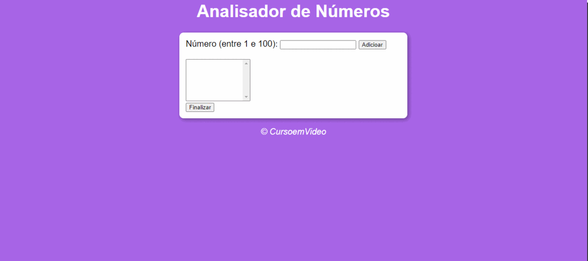

<h1>

</h1>


<h1 align="center">
Analisador de Números
</h1>

# Indice


- [Sobre](#-sobre)
- [Tecnologias utilizadas](#💻-tecnologias-utilizadas)
- [Como baixar o projeto](#📥-como-baixar-o-projetocomo-baixar-o-projeto)

___

## 📋Sobre


Este é um código em JavaScript que permite adicionar valores a uma lista e analisá-los posteriormente, mostrando o total de valores adicionados, o maior e o menor valor, a soma total e a média. E ainda possui algumas validações, se você inserir o mesmo valor, irá aparecer um alerta informando que o valor é inválido e se você clicar em finalizar sem inserir números na lista, irá aparecer outro alerta solicitando para inserir números antes de finalizar.
___


## 💻Tecnologias utilizadas 


O exercício foi desenvolvido utilizando as seguintes tecnologias:

- HTML
- CSS
- JavaScript

___

## 📥 Como baixar o projeto

```bash
    # Clonar o repositório
    $ git clone  https://github.com/AlineCD/analisadorDeNumeros
``` 
